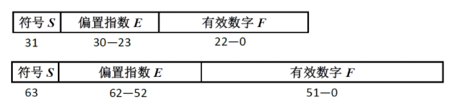

## 实验报告1
##### 姓名：吴毅龙    学号：PB19111749

### 1. 问题1
分别对如下两个函数作编程计算$$ f(x)=\sqrt{x^2+9}-3 $$ $$ g(x)=\frac{x^2}{\sqrt{x^2+9}+3} $$
#### 1.1 计算过程及计算结果
使用C++编写程序计算个x值下各个函数的值，程序如下所示：
```C++
#include<iostream>
#include <cmath>
#include<stdio.h>
using namespace std;

float function1(float x)
{
	return sqrt(pow(x, 2) + 9) - 3;
}

float function2(float x)
{
	return pow(x, 2) / (sqrt(pow(x, 2) + 9) + 3);
}

void lab1_1()
{
	float x = 4;
	float result1, result2;
	int i = 0;
	for (; i < 10; i++)
	{
		x = pow(4, -1 - i);
		result1 = function1(x);
		result2 = function2(x);
		printf("x = %.12E  f(x) = %.12E  g(x) = %.12E\n", x, result1, result2);
	}
}

int main()
{
	lab1_1();
	return 0;
}
```
计算结果如下所示：

| x                  | $$ f(x)=\sqrt{x^2+9}-3 $$ | $$ g(x)=\frac{x^2}{\sqrt{x^2+9}+3} $$ |
| ------------------ | ------------------------- | ------------------------------------- |
| 2.500000000000E-01 | 1.039862632751E-02        | 1.039864402264E-02                    |
| 6.250000000000E-02 | 6.508827209473E-04        | 6.509710219689E-04                    |
| 1.562500000000E-02 | 4.076957702637E-05        | 4.068982525496E-05                    |
| 3.906250000000E-03 | 2.622604370117E-06        | 2.543130221966E-06                    |
| 9.765625000000E-04 | 2.384185791016E-07        | 1.589457241380E-07                    |
| 2.441406250000E-04 | 0.000000000000E+00        | 9.934107758625E-09                    |
| 6.103515625000E-05 | 0.000000000000E+00        | 6.208817349140E-10                    |
| 1.525878906250E-05 | 0.000000000000E+00        | 3.880510843213E-11                    |
| 3.814697265625E-06 | 0.000000000000E+00        | 2.425319277008E-12                    |
| 9.536743164063E-07 | 0.000000000000E+00        | 1.515824548130E-13                    |

#### 1.2 计算结果分析
根据上表我们可以发现在表格的前两行，也就是当x的值还不是很接近于0的时候，计算出的f(x)与g(x)的函数值还是比较接近的，但是当x开始逐渐趋近与0，f(x)与g(x)的差距也随之增大。

经过分析和计算数据的比较，我们可以得出经过函数g(x)计算得到的值较为可靠，理由如下：
1. 计算中应尽量避免**两相近数相减**，因为会导致相对误差变大。当x趋近于0时，在函数f(x)中，$\sqrt{x^2+9}$与3就是相近数，因此后面随着x愈来愈趋近于0，误差也愈来愈大；
2. 计算中应尽量避免**小数做分母**，因为会导致绝对误差变大。函数g(x)在计算时，尽管x的值在趋近于0，但是函数的分母一直不是小数，从而一定程度上减小了这方面带来的误差。

综上所述，我们认为g(x)函数的计算结果更加可靠。

### 2. 问题2
给定一组数据4041.045551380452, -2759471.276702747, -32.64291531266504,  2755462.874010974,  0.0000557052996742893，
分别采取以下3种方式求和，
(a) 顺序求和； 
(b) 逆序（从后往前）求和；
(c) 正数从大到小求和，负数从小到大求和，再相加；
#### 2.1 计算过程及计算结果
使用C++编写程序计算个x值下各个函数的值，程序如下所示：
```C++
#include<iostream>
#include <cmath>
#include<stdio.h>
using namespace std;

void lab1_2()
{
	double num1 = 4041.045551380452;
	double num2 = -2759471.276702747;
	double num3 = -32.64291531266504;
	double num4 = 2755462.874010974;
	double num5 = 0.0000557052996742893;
	double result1, result2, result3;
	double pos, neg;
	//顺序求和
	result1 = num1 + num2 + num3 + num4 + num5;
	//逆序求和
	result2 = num5 + num4 + num3 + num2 + num1;
	//正数从大到小求和，负数从小到大求和，再相加
	pos = num4 + num1 + num5;
	neg = num2 + num3;
	result3 = pos + neg;
	printf("result1=%.6E\nresult2=%.6E\nresult3=%.6E\n", result1, result2, result3);
}

int main()
{
	lab1_2();
	return 0;
}
```
计算结果如下所示：

|          | 方法a        | 方法b         | 方法c        |
| -------- | ------------ | ------------- | ------------ |
| 计算结果 | 1.025188E-10 | -1.564331E-10 | 0.000000E+00 |

#### 2.2 计算结果分析
双精度数在计算机中的存储形式和数据结构造成了上述计算结果的误差，以下将从双精度数的数据结构角度分析为什么浮点数运算会出现误差，同时提供给一些减小浮点数运算误差的方法。

在计算机中，小数有两种表示方式：定点数和浮点数。定点数的小数点隐含在某一个固定的位置上，表示简单但是可以表示的数的范围小。浮点数利用科学计数法分别存储数的符号位、指数和有效位，可以表示的数的范围增大。IEEE 754标准规定的单精度和双精度浮点数的存储格式如图所示，最高位是符号位![[公式]](https://www.zhihu.com/equation?tex=S)，规定浮点数的正负；偏置指数![[公式]](https://www.zhihu.com/equation?tex=E)，紧跟在符号位之后，占![[公式]](https://www.zhihu.com/equation?tex=w)位；有效数字![[公式]](https://www.zhihu.com/equation?tex=F)在最后，占![[公式]](https://www.zhihu.com/equation?tex=p)位。


浮点数表示的数据范围比定点数更广泛，但它并不能精确的表示在最大数和最小数之间的所有实数，例如无理数![[公式]](https://www.zhihu.com/equation?tex=%5Csqrt%7B3%7D)，有理数![[公式]](https://www.zhihu.com/equation?tex=0.1)。浮点数不仅在实数的表示上存在误差，在数值运算上也存在误差。为了方便理解，设浮点数的底数为10，有3个有效数字。计算![[公式]](https://www.zhihu.com/equation?tex=2.15%5Ctimes+%7B%7B10%7D%5E%7B12%7D%7D-1.25%5Ctimes+%7B%7B10%7D%5E%7B4%7D%7D)，则先进行指数对齐，得到：

![[公式]](https://www.zhihu.com/equation?tex=x%3D2.15%5Ctimes+%7B%7B10%7D%5E%7B12%7D%7D)

![[公式]](https://www.zhihu.com/equation?tex=y%3D0.00000000125%5Ctimes+%7B%7B10%7D%5E%7B12%7D%7D)

![[公式]](https://www.zhihu.com/equation?tex=x-y%3D2.15%5Ctimes+%7B%7B10%7D%5E%7B12%7D%7D)

如果对两个绝对值差别很大的两个数作加减操作，就会出现上述所示的“大数吃小数”的现象。被消除的小数![[公式]](https://www.zhihu.com/equation?tex=1.25%5Ctimes+%7B%7B10%7D%5E%7B4%7D%7D)，就是本次运算的误差值。

此外，由于浮点数范围的局限，如果两个特别大（小）的数相乘或除以一个特别小（大）的数，就可能造成上（下）溢，这也是误差的一个来源。

在运算过程中，重复利用上一次浮点运算的结果，可能造成误差的累加。例如，计算多项式![[公式]](https://www.zhihu.com/equation?tex=%7B%7Bx%7D%5E%7B4%7D%7D)，如果先计算![[公式]](https://www.zhihu.com/equation?tex=%7B%7Bx%7D%5E%7B2%7D%7D%3Dx%5Ccdot+x)，再计算![[公式]](https://www.zhihu.com/equation?tex=%7B%7Bx%7D%5E%7B3%7D%7D%3D%7B%7Bx%7D%5E%7B2%7D%7D%5Ccdot+x)，最后计算![[公式]](https://www.zhihu.com/equation?tex=%7B%7Bx%7D%5E%7B4%7D%7D%3D%7B%7Bx%7D%5E%7B3%7D%7D%5Ccdot+x)，共有3次运算的叠加，叠加的次数越多，可能造成的误差也将越大。

回到原来的问题上，方法a的顺序求和和方法b逆序求和都会存在上述“大数吃小数”的情况，从而造成误差，而对于方法c，正数和负数的两次相加运算都会存在“大数吃小数”，损失有效数位，造成误差，所以我认为上述三种方法**都不是**精确的计算方法。

因此在此提出一种个人认为**较优**的计算顺序：$$ num2 + num4 + num1 + num3 + num5$$，最终计算出的结果为$-5.250740E-11$

最后总结一下，在涉及浮点数的算法中遵循下面几个原则，尽可能的减少由于浮点数造成的错误，或者减少误差：
1. 避免相近的两数相减
2. 避免小分母
3. 避免大数吃小数
4. 简化计算步骤